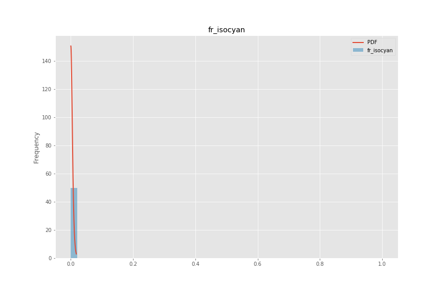
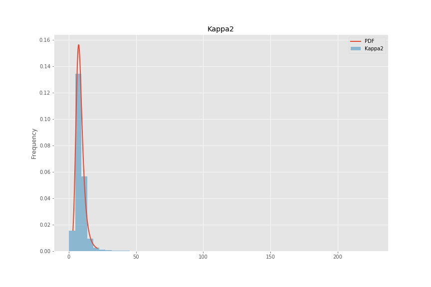
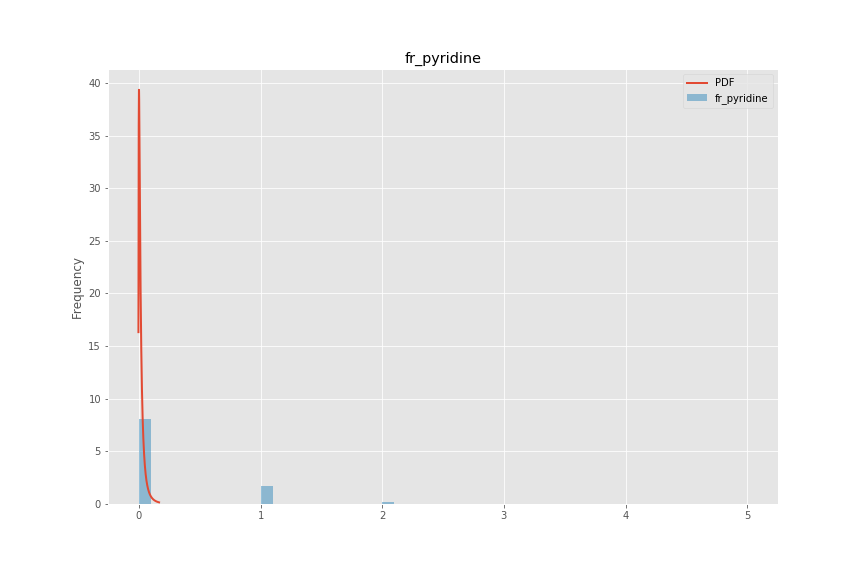
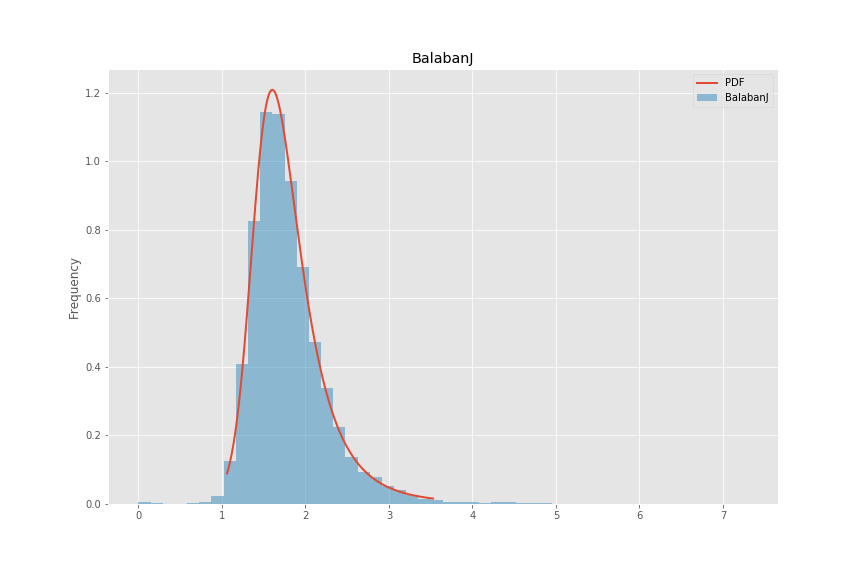

## Methods

### Feature Normalization

Features used in conjunction with the graph convolution are computed with the RDKit toolkit[X].
The neural network architecture requires that the features are appropriately scaled to prevent features with large ranges dominating smaller ranged features as well as preventing issues where features in the training set are not drawn from the same sample distribution as the testing sets.
prevent these issues, a large sample of molecules was used to fit cumulative density function (CDF) to all features.
CDF were used as opposed to simpler scaling algorithms mainly because CDFs have the useful property that each value has the same meaning: the percentage of the population observed below the raw feature value.
Min-max scaling can be easily biased with outliers and Z-score scaling assumes a normal distribution which is most often not the case for chemical features, especially if they are based on counts.

The CDFs were fit to a sampling of 100k compounds from the Novartis internal catalog using the distributions available in the scikit learn package[X], a sampling of which can be seen in Figure X.
scikit learn was used primarily due to the simplicity of fitting and the final application, however more complicated techniques can be used in the future to fit to empirical CDFs such as finding the best fit general logistic function[X] which has been shown to be successful for other biological datasets.
The sample distributions and fits are available in the supplementary material.
No review was taken to remove odd distributions; for example, azides are hazardous and rarely used outside of a few specific reactions.
This is reflected in the fr_azide distribution.
As such, since the sample data was primarily used for chemical screening against biological targets, the distribution used here may not accurately reflect the distribution of reagents used for chemical synthesis.

Future work should include detecting ill-fitting distributions, such as for fr_pyridine as seen in Figure X, and using alternative methods, such as empirical distributions.

Figure 1 Four example distributions fit to a random sample of 100,000 of compounds used for biological screening in Novartis.
Note that some distributions for discrete calculations, such as fr_pyridine are not fit especially well.
This is an active area for improvement.

### List of descriptors used:
1. BalabanJ
2. BertzCT
3. Chi0
4. Chi0n
5. Chi0v
6. Chi1
7. Chi1n
8. Chi1v
9. Chi2n
10. Chi2v
11. Chi3n
12. Chi3v
13. Chi4n
14. Chi4v
15. EState_VSA1
16. EState_VSA10
17. EState_VSA11
18. EState_VSA2
19. EState_VSA3
20. EState_VSA4
21. EState_VSA5
22. EState_VSA6
23. EState_VSA7
24. EState_VSA8
25. EState_VSA9
26. ExactMolWt
27. FpDensityMorgan1
28. FpDensityMorgan2
29. FpDensityMorgan3
30. FractionCSP3
31. HallKierAlpha
32. HeavyAtomCount
33. HeavyAtomMolWt
34. Ipc
35. Kappa1
36. Kappa2
37. Kappa3
38. LabuteASA
39. MaxAbsEStateIndex
40. MaxAbsPartialCharge
41. MaxEStateIndex
42. MaxPartialCharge
43. MinAbsEStateIndex
44. MinAbsPartialCharge
45. MinEStateIndex
46. MinPartialCharge
47. MolLogP
48. MolMR
49. MolWt
50. NHOHCount
51. NOCount
52. NumAliphaticCarbocycles
53. NumAliphaticHeterocycles
54. NumAliphaticRings
55. NumAromaticCarbocycles
56. NumAromaticHeterocycles
57. NumAromaticRings
58. NumHAcceptors
59. NumHDonors
60. NumHeteroatoms
61. NumRadicalElectrons
62. NumRotatableBonds
63. NumSaturatedCarbocycles
64. NumSaturatedHeterocycles
65. NumSaturatedRings
66. NumValenceElectrons
67. PEOE_VSA1
68. PEOE_VSA10
69. PEOE_VSA11
70. PEOE_VSA12
71. PEOE_VSA13
72. PEOE_VSA14
73. PEOE_VSA2
74. PEOE_VSA3
75. PEOE_VSA4
76. PEOE_VSA5
77. PEOE_VSA6
78. PEOE_VSA7
79. PEOE_VSA8
80. PEOE_VSA9
81. RingCount
82. SMR_VSA1
83. SMR_VSA10
84. SMR_VSA2
85. SMR_VSA3
86. SMR_VSA4
87. SMR_VSA5
88. SMR_VSA6
89. SMR_VSA7
90. SMR_VSA8
91. SMR_VSA9
92. SlogP_VSA1
93. SlogP_VSA10
94. SlogP_VSA11
95. SlogP_VSA12
96. SlogP_VSA2
97. SlogP_VSA3
98. SlogP_VSA4
99. SlogP_VSA5
100. SlogP_VSA6
101. SlogP_VSA7
102. SlogP_VSA8
103. SlogP_VSA9
104. TPSA
105. VSA_EState1
106. VSA_EState10
107. VSA_EState2
108. VSA_EState3
109. VSA_EState4
110. VSA_EState5
111. VSA_EState6
112. VSA_EState7
113. VSA_EState8
114. VSA_EState9
115. fr_Al_COO
116. fr_Al_OH
117. fr_Al_OH_noTert
118. fr_ArN
119. fr_Ar_COO
120. fr_Ar_N
121. fr_Ar_NH
122. fr_Ar_OH
123. fr_COO
124. fr_COO2
125. fr_C_O
126. fr_C_O_noCOO
127. fr_C_S
128. fr_HOCCN
129. fr_Imine
130. fr_NH0
131. fr_NH1
132. fr_NH2
133. fr_N_O
134. fr_Ndealkylation1
135. fr_Ndealkylation2
136. fr_Nhpyrrole
137. fr_SH
138. fr_aldehyde
139. fr_alkyl_carbamate
140. fr_alkyl_halide
141. fr_allylic_oxid
142. fr_amide
143. fr_amidine
144. fr_aniline
145. fr_aryl_methyl
146. fr_azide
147. fr_azo
148. fr_barbitur
149. fr_benzene
150. fr_benzodiazepine
151. fr_bicyclic
152. fr_diazo
153. fr_dihydropyridine
154. fr_epoxide
155. fr_ester
156. fr_ether
157. fr_furan
158. fr_guanido
159. fr_halogen
160. fr_hdrzine
161. fr_hdrzone
162. fr_imidazole
163. fr_imide
164. fr_isocyan
165. fr_isothiocyan
166. fr_ketone
167. fr_ketone_Topliss
168. fr_lactam
169. fr_lactone
170. fr_methoxy
171. fr_morpholine
172. fr_nitrile
173. fr_nitro
174. fr_nitro_arom
175. fr_nitro_arom_nonortho
176. fr_nitroso
177. fr_oxazole
178. fr_oxime
179. fr_para_hydroxylation
180. fr_phenol
181. fr_phenol_noOrthoHbond
182. fr_phos_acid
183. fr_phos_ester
184. fr_piperdine
185. fr_piperzine
186. fr_priamide
187. fr_prisulfonamd
188. fr_pyridine
189. fr_quatN
190. fr_sulfide
191. fr_sulfonamd
192. fr_sulfone
193. fr_term_acetylene
194. fr_tetrazole
195. fr_thiazole
196. fr_thiocyan
197. fr_thiophene
198. fr_unbrch_alkane
199. fr_urea
200. qed

[X] RDKit 2018.09.01

[X] scikit learn version …
